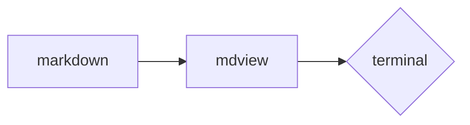

# mdview サンプル

`mdview` の表示確認用ドキュメント。すべての主要なmarkdown要素を含む。

## 目次

- [段落と強調](#段落と強調)
- [テーブル](#テーブル)
- [Mermaid](#mermaid)

## 段落と強調

これは普通の段落で、**太字**、*斜体*、`inline code`、~~取消線~~、[リンク](https://example.com)を含みます。

## 見出しの階層

### H3 ヘッダ

#### H4 ヘッダ

##### H5 ヘッダ

###### H6 ヘッダ

## リスト

- 箇条書き 1
- 箇条書き 2
  - ネスト 1
  - ネスト 2
- 箇条書き 3

1. 順序付き 1
2. 順序付き 2
3. 順序付き 3

## コードブロック

```python
def greet(name: str) -> str:
    """Greet by name."""
    return f"Hello, {name}!"


print(greet("world"))
```

```bash
uv run mdview README.md
```

## 引用

> 良いツールは、それを使う人の意図を増幅する。
> — anonymous

## テーブル

| Key       | Value      |
|-----------|------------|
| 言語       | Python     |
| TUI       | Textual    |
| 画像       | Kitty graphics |

## 区切り線

---

## 画像 (SVG)

下にSVGバッジが表示されるはず:


## Mermaid



これでサンプルは終わり。
